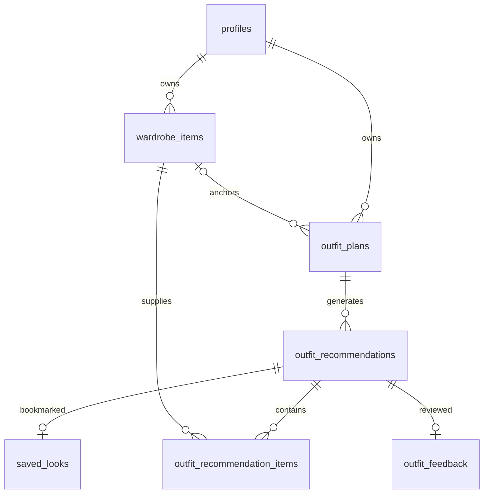

# Wardrobe and outfit database

The existing `profiles` migration remains the foundation. The next migration adds
six tables without recreating profiles, changing Auth settings, or moving user data.
All seven tables are private to their owner. Authentication email confirmation is a
Supabase project setting, independent of this schema.



## Tables and data choices

| Table | Stored data and cardinality |
| --- | --- |
| `profiles` | One per Auth user: UUID `id`, display name, optional avatar URL, timestamps. The existing Auth trigger creates and backfills profiles. Email and credentials stay in Supabase Auth. |
| `wardrobe_items` | UUID `id` and `user_id`; optional HTTP(S) `image_url` and `product_url`; required `name` and `category`; optional `brand`, `subcategory`, `primary_colour`, `pattern`, `fit`, `formality`, `warmth_level`, `sleeve_length`, and `neckline`; arrays for `secondary_colours`, `material`, `season`, `style_tags`; boolean `favourite`; optional `archived_at`; timestamps. |
| `outfit_plans` | Generation inputs: required occasion; optional planned date, location, temperature and feels-like in Celsius, precipitation probability (0–100), weather summary and observation time, formality, owned anchor item, and free-text instructions. Arrays store style preferences, preferred colours, and excluded categories. One plan can have multiple recommendations, including later regeneration attempts. |
| `outfit_recommendations` | Required owned plan, recommendation kind and title; optional explanation and styling notes. JSONB object for non-secret model/prompt provenance only. Core relational data is not stored in JSON. |
| `outfit_recommendation_items` | Required owned recommendation and wardrobe item; role and nonnegative position. One piece appears at most once per recommendation. Multiple pieces can share a role for layering or jewellery. Sort by position, then id for deterministic ties. |
| `saved_looks` | Bookmark of an owned recommendation, optional custom name and notes. One save per user/recommendation. Removing the save keeps the recommendation. This is a live reference, not an immutable snapshot. |
| `outfit_feedback` | One editable record per user/recommendation: boolean worn (default false), optional wear date, optional 1–5 rating, optional reaction, optional feedback text. A wear date requires worn=true. This is current feedback, not a repeated-wear event log. |

Every new table has UUID `id`, UUID `user_id` defaulting to `auth.uid()`, and
`timestamptz` creation/update times. Creation and update times are set by the database;
clients cannot change the id, owner, or creation time after insertion.

Enums constrain stable vocabularies:

- Category and item role: `top`, `bottom`, `dress`, `outerwear`, `shoes`, `bag`, `jewellery`, `accessory`.
- Fit: `fitted`, `regular`, `relaxed`, `oversized`.
- Season: `spring`, `summer`, `autumn`, `winter`; an array supports several seasons.
- Formality: `casual`, `smart_casual`, `business`, `semi_formal`, `formal`.
- Sleeve length: `sleeveless`, `short`, `elbow`, `three_quarter`, `long`.
- Recommendation kind: `safe_choice`, `more_stylish`, `something_different`.
- Reaction: `love`, `like`, `neutral`, `dislike`.

Unknown scalar attributes are NULL; empty arrays mean unspecified. All four seasons
means year-round. Warmth is 1 (very light) through 5 (very warm). Dates represent local
calendar dates, while timestamps are absolute instants. `numeric(5,2)` stores temperatures.
Text arrays allow fabric blends and multiple colours/tags without comma-separated strings.
Colours, materials, subcategories, patterns, and necklines intentionally remain extensible
text because their vocabulary is open-ended. The app should normalize spelling/case.
SQL limits text lengths, validates important ranges, and disallows NULL array elements.
A styling role may differ from the garment category (for example, a shirt as outerwear).

## Ownership and deletion

RLS grants authenticated users SELECT, INSERT, UPDATE, and DELETE on their own new
rows only. INSERT uses WITH CHECK; UPDATE checks both the existing and resulting owner.
Anonymous access is revoked. The original profile permissions remain stricter: users
can read their profile and edit only display_name/avatar_url; Auth manages its lifecycle.

Ownership is also enforced structurally: `(user_id, parent_id)` foreign keys reference
`(user_id, id)` unique keys. A caller cannot save, review, or associate someone else's
recommendation or item. This holds even for writes performed by a backend bypassing RLS.
Backend service-role access is privileged and belongs only on trusted servers.

- Deleting an Auth user cascades through their profile and all owned records.
- Deleting a plan cascades to its recommendations, item links, saves, and feedback.
- Deleting a recommendation removes its links, saves, and feedback, keeping wardrobe items.
- Deleting a wardrobe item with an anchor or outfit reference is blocked. Archive it
  using `archived_at`, or explicitly remove references before hard deletion.
- Archiving an item preserves saved-look references. Editing its attributes is reflected
  in existing looks. A future immutable history feature would require explicit snapshots.

Indexes cover owner-scoped chronological lists, active wardrobe categories, favourites,
foreign-key lookups, and recommendation item ordering. GIN indexes support array filters
on seasons and style tags. Unique keys already cover saved-look and feedback lookups.
Additional indexes should follow observed queries rather than indexing every attribute.

The follow-up `20260926000200_wardrobe_images.sql` migration adds image_path and a
private Storage bucket with ownership policies. New uploads persist object paths;
signed display URLs expire after ten minutes. Legacy image_url rows remain supported.
See [photo setup](PHOTOS.md).

## Apply the SQL

For the existing project where the profiles migration has already been applied, run
**only** `migrations/20260926000100_wardrobe_and_outfits.sql` in Supabase SQL Editor,
or deploy it through the project's migration workflow. It is transactional and applies once.
Do not drop/recreate the existing profiles table.

For a fresh project, run all files in `migrations/` in timestamp order. Alternatively,
paste the complete `sql/full_schema.sql` into SQL Editor. That file combines all migrations
in a single transaction; it is an alternative for fresh setup, not a third migration.
Do not run the combined file on a project that already has these tables. When mixing
manual SQL Editor setup with CLI migrations, reconcile migration history before pushing.

No hosted migration is applied automatically by this task. Public app keys cannot perform
schema migrations; use SQL Editor or an authorized database migration connection.

My Wardrobe now uses the wardrobe_items table and saves anchored briefs to outfit_plans.
The client types cover these tables and profiles. Recommendation and saved-look UI still
uses sample outfit data; extend client types when wiring those services.

## Verification

With this project's local Supabase Docker container running:

```sh
npm run test:database
npm run lint
npm run typecheck
```

The database test creates a disposable database inside `supabase_db_sarrahs-wardrobe-app`
and drops only that database afterward. It never reads `.env` and never connects to hosted
Supabase. A minimal Auth identity boundary supplies users and `auth.uid()`; PostgreSQL
executes real migrations, grants, policies, constraints, and triggers.

Coverage includes profile creation, owner CRUD, foreign-user and anonymous access,
forged ownership, cross-owner foreign keys, identity/timestamp protection, duplicate
saves/feedback/pieces, invalid values, layering, archiving, deletion restrictions, and
plan/account cascades. This validates database enforcement, not a deployed PostgREST API
or future AI-generation service.

References: [Supabase RLS](https://supabase.com/docs/guides/database/postgres/row-level-security)
and [Auth-linked profiles](https://supabase.com/docs/guides/auth/managing-user-data).
